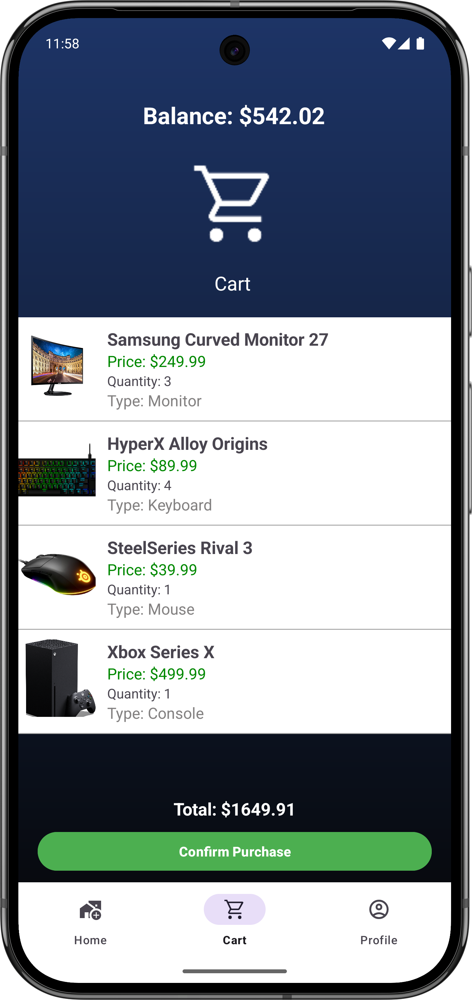
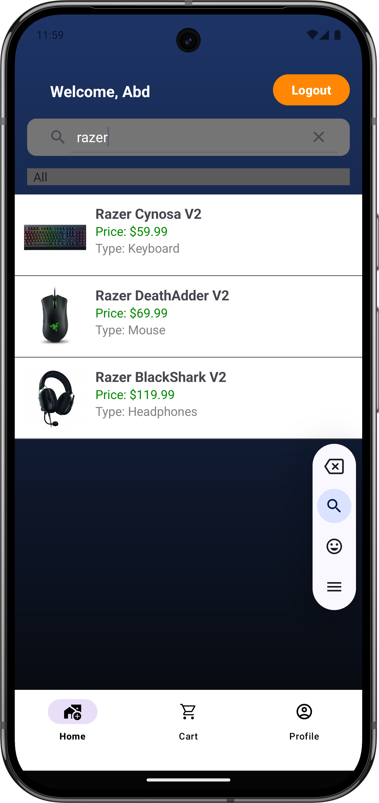
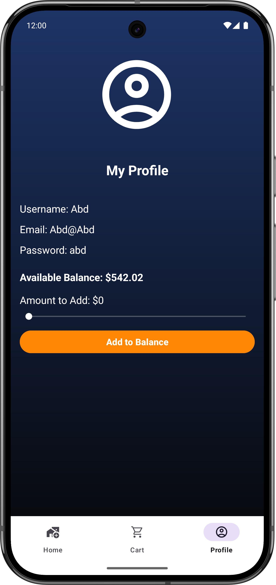
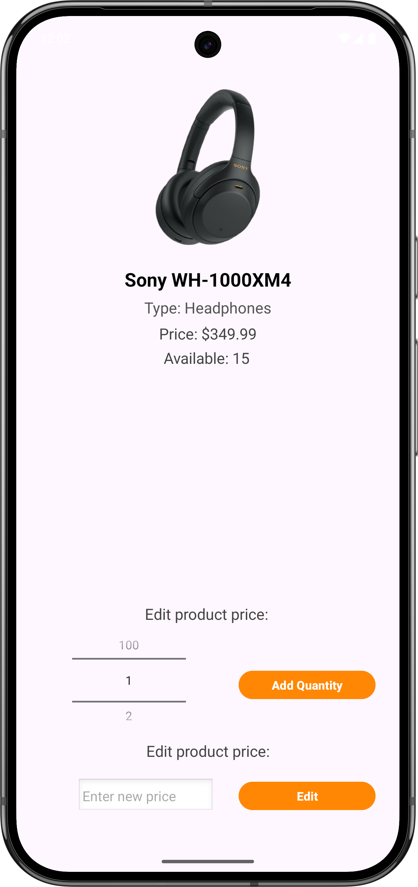

# 📱 TECHY - Android E-Commerce App

TECHY is a modern Android e-commerce application for selling and browsing tech gadgets like GPUs, keyboards, monitors, and more. It provides a seamless experience for both customers and admins, offering real-time cart, purchase history, profile management, and product editing functionalities.

---

## ✨ Features

- 🔍 Product search and category filter
- 🛒 Add to cart and checkout with balance verification
- 👤 Profile page with balance top-up
- 🛠 Admin functionality to update stock and pricing
- 📂 Persistent storage using SharedPreferences
- 🖼️ Product images dynamically loaded via resource names
- 🔄 Smooth navigation with BottomNavigationView

---

## 📄 Pages Overview

| Page             | Description                                |
|------------------|--------------------------------------------|
| Home             | Browse, search, and filter all products    |
| Cart             | View items added to cart and checkout      |
| Profile          | View user info and manage balance          |
| Admin Home       | View all products (admin view)             |
| Product Detail   | View product info and adjust quantities    |
| Admin Product    | Edit product price and stock (admin only)  |

---

## 📷 Screenshots

Here are some screenshots of the TECHY app:

- 🚦 Login Page  
  

- 🏠 Home Page  
  

- 🛒 Cart Page  
  

- 🔎 Search & Filter  
  

- 👤 Profile Page  
  

- 🛠 Admin Edit Product  
  

---

## 🎥 Demo Video

📽️ Watch the app in action here: **[Demo Video](https://drive.google.com/file/d/1BXJOtPN3xNEwB-xKMGYFwYStUbQtUs_f/view?usp=sharing)**  

---

